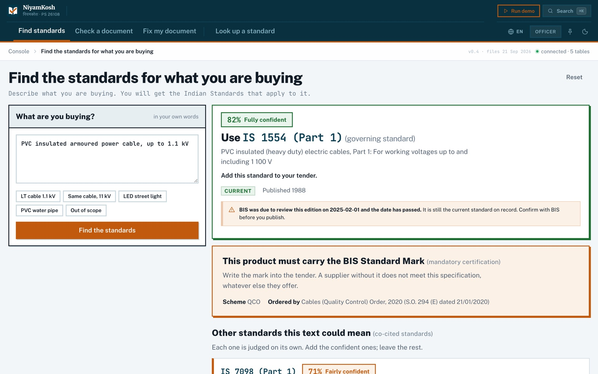
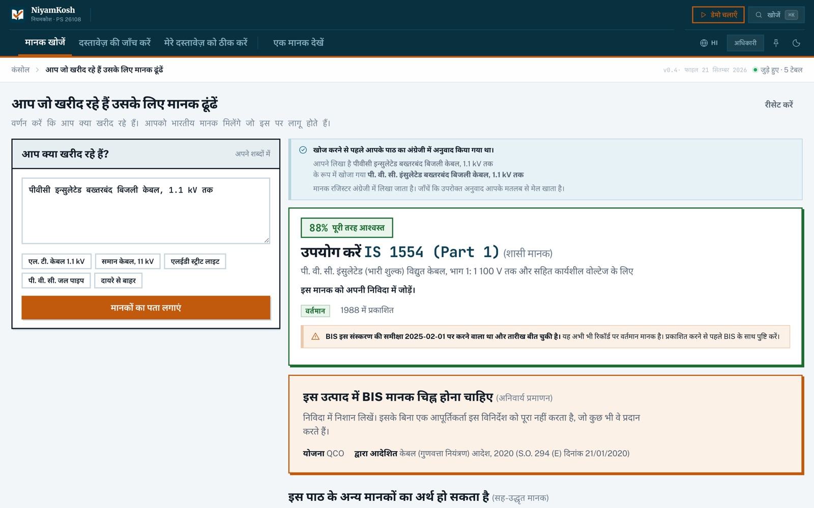
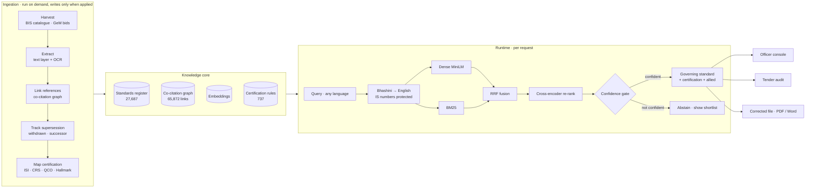
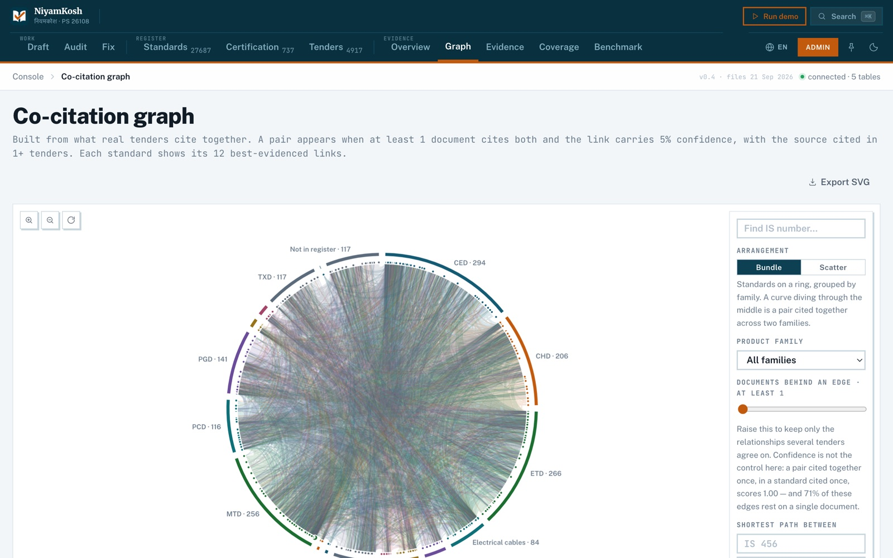
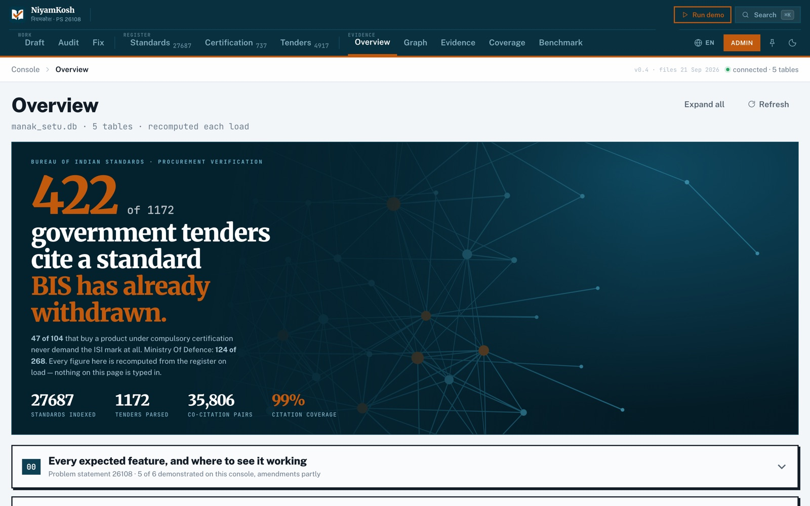

<div align="center">


# NiyamKosh · नियमकोश

### Describe what you are buying. Get the right Indian Standard — and your tender back, corrected.

**Smart India Hackathon 2026 · Problem Statement SIH26108** · Ministry of Consumer Affairs, Food & Public Distribution (BIS)<br/>
*AI-Powered Recommendation Engine for Identifying Applicable Indian Standards for Procurement Specifications*

<br/>


[](https://github.com/Jay-Naik2526/niyamkosh/actions/workflows/checks.yml)

**Team The RAGnarok**

</div>

---

<table>
<tr>
<td width="33%" align="center">

### 591 of 1,619
real government tenders cite a standard **BIS has already withdrawn**

</td>
<td width="33%" align="center">

### 47 of 104
tenders for products under a Quality Control Order **never ask for the ISI mark**

</td>
<td width="33%" align="center">

### 124 of 268
**Ministry of Defence** tenders cite a withdrawn standard today

</td>
</tr>
</table>

<sub>Measured on the collected corpus, not estimated. A wrong or dead standard in a tender means the wrong product is supplied, rejected at inspection, and fought over.</sub>

---

## ✦ What NiyamKosh does

<table>
<tr>
<td width="50%" valign="top">

#### 🔎 Find the standard from plain words
Type *"PVC insulated armoured power cable, up to 1.1 kV"* — in English or an Indian language — and get the **governing standard**, a confidence band, the **mandatory certification** and the standards real tenders **buy alongside it**. No IS number needed.

</td>
<td width="50%" valign="top">

#### 🧾 Check a tender before it is published
Upload a PDF or Word tender (scans too — OCR). Every IS number is checked against the register: **withdrawn**, **superseded**, **not in register**, **missing certification**, **missing allied standard** — each with its source.

</td>
</tr>
<tr>
<td width="50%" valign="top">

#### 🛠️ Get the tender back corrected
Withdrawn citations replaced with the successor **BIS records**, the Standard Mark clause inserted where the law demands it, allied standards added from comparable tenders — **in the same file, with the same letterhead**, as PDF or Word. The corrected file is then audited again from scratch.

</td>
<td width="50%" valign="top">

#### 🌐 Works where officers already are
The **whole console** translates into 11 Indian languages through **Bhashini**, results included. A **browser extension** checks the tender page you are already on — GeM, CPPP eProcure, nProcure — and the tender text never leaves your machine.

</td>
</tr>
</table>

<div align="center">

| English | हिन्दी — the whole page, results included |
|:---:|:---:|
|  |  |

</div>

---

## ✦ It never invents a standard

The rule the whole system is built around: **a model may phrase the output, it never decides the standard.**

- Every IS number NiyamKosh names is a row in the 27,687-standard register — **0 answers outside the register** across 621 test queries.
- When the evidence is weak it **says so and shows the shortlist** instead of guessing (a confidence gate, measured below).
- Every edit to a tender names its source: *a BIS record*, *a certification rule*, or *comparable real tenders*.
- A withdrawn standard with no recorded successor is **flagged for a human**, never silently replaced.
- IS numbers, voltages, scheme codes and Gazette references are **held back from the translator** and restored exactly.

---

## ✦ Architecture



<div align="center">


<br/><sub>Admin console — the co-citation graph learned from real tenders, and the live overview recomputed from the register on every load.</sub>
</div>

---

## ✦ Measured, not claimed

Evaluated on **621 product descriptions** taken from BIS's own certification notifications — each names a product in its own words and states the standard that applies, so the label comes from a legal instrument, not from us.

| | Result |
|---|---|
| Correct standard **ranked first** | **492 / 621** |
| Correct standard **in the top 10** | **608 / 621** |
| Declined to answer instead of guessing | **38 / 621** |
| Answers naming a standard **outside the register** | **0** |
| Mean time to answer | **122 ms** on a laptop |

<details>
<summary><b>Why the cross-encoder stays, and other honest details</b></summary>

<br/>

- `eval_pipelines.py` runs six pipelines over the same 621 pairs (`data/pipeline_leaderboard.json`). The cross-encoder's rank-1 lead over plain fusion is 7 queries and is **not** statistically significant (McNemar p = 0.296). It stays for the **right to decline**: 38 abstentions against 1. On those 38, the pipeline without it answers 37 confidently and is **wrong on 30**.
- Rank-1 is counted on the retriever's top candidate, including the 38 queries where the gate then declines. The correct answer was in the shortlist for 34 of those 38 — which is exactly what the shortlist is for.
- The score is **concentrated, not calibrated** (expected calibration error 0.161), so the interface never prints "100%" and never reads a score as a probability.
- Adding co-citation neighbours to retrieval (`graph_expand`) is a **measured negative result**: same rank-1, recall@10 falls from 608 to 591. It is kept in the leaderboard, not in the product.

</details>

---

## ✦ The data

| Source | What we hold | How |
|---|---|---|
| **BIS catalogue** | 27,687 standards — number, title, year, status, successor, Hindi title where BIS publishes one | `collect_catalogue.py`, BIS's public search endpoint |
| **GeM public bids** | 4,917 tenders, citations read literally from buyer attachments; 3,173 scans recovered by OCR | `collect_gem_tenders.py`, `collect_tender_ocr.py` |
| **Co-citation graph** | 65,872 standard-to-standard links with the tender evidence behind each | `rebuild_graph.py` |
| **Certification** | 737 rules — ISI Mark Scheme I 628 · QCO 77 · CRS 30 · Hallmarking 2 | `collect_certification.py` |

**We hold metadata only.** BIS standards are priced publications, so the system stores numbers, titles, status and public citations — never the standard's text. Nothing to license, nothing to infringe. The CSVs in `data/` change only through collect → merge; no row is ever written by hand or by a model.

---

## ✦ Run it

```bash
python3 -m venv backend_venv && source backend_venv/bin/activate
pip install -r requirements.txt

cp .env.example .env          # add BHASHINI_INFERENCE_KEY (and optionally GEMINI_API_KEY)

python load_db.py             # builds the SQLite database from the CSVs
python build_embeddings.py    # one-time embedding build

uvicorn main:app --port 8000
```

Open **http://localhost:8000** — FastAPI serves the console itself.

- `?role=officer` for the officer screens, `?role=admin` for the full console, `?lang=hi` (or `ta`, `mr`, `bn`, …) for any language.
- **Run demo** in the header walks through the whole flow.
- Try Fix my document with `samples/sample-tender.docx` or `samples/sample-tender.pdf`.
- **Browser extension:** `chrome://extensions` → *Developer mode* → *Load unpacked* → select `extension/`.

<details>
<summary><b>Growing the corpus</b></summary>

<br/>

```bash
python collect_gem_tenders.py --sample 2000 --seed 3   # resumable, ~1 bid/s
python merge_gem_tenders.py                            # dry run: what would change
python merge_gem_tenders.py --write                    # additive merge
python rebuild_graph.py && python rebuild_backlog.py && python load_db.py
```

Service bids are skipped, scans are kept and routed to OCR, and every row's product family is taken from its citations as resolved in the register — never guessed from wording. Fetched PDFs stay in `data/tenders/` and are not committed.

</details>

---

## ✦ API

| Method | Endpoint | Purpose |
|---|---|---|
| `POST` | `/recommend` | Plain-language spec → governing standard, confidence band, certification, allied standards, clause |
| `POST` | `/analyze` | Audit a list of IS numbers or clause text |
| `POST` | `/extract` | Upload a tender PDF / DOCX → literal IS-citation extraction (OCR for scans) |
| `POST` | `/fix-document` | Upload a tender → corrected file, every change sourced, re-audited |
| `POST` | `/translate` | Bhashini translation for the console, identifiers protected |
| `GET` | `/standard?is_number=` | One standard with status, successor, certification and co-citations |
| `GET` | `/graph` · `/stats` · `/benchmark` | Co-citation graph · live aggregates · benchmark re-run |
| `GET` | `/health` | Row counts per table, and when BIS was last checked |
| `POST` | `/report` | The audit as a printable compliance report |

```bash
curl -s localhost:8000/recommend -H 'content-type: application/json' \
  -d '{"spec_text":"PVC insulated armoured power cable, up to 1.1 kV"}'
```

---

## ✦ Checks

Every push runs gates that refuse the bugs this project actually had — two places holding the same fact and drifting apart.

| Gate | What it refuses |
|---|---|
| `consistency_check.py` | Coverage and backlog disagreeing; a graph node that resolves to nothing; stored citations the pattern refuses; `/stats` disagreeing with `COUNT(*)`; a dry run that wrote anything |
| `qa_adversarial.py` | 41 cases that must fail safely — corrupt PDFs, scans with no text, phantom citations, overrides without a reason, repairs that multiply citations or lose the letterhead |
| `qa_frontend.py` | A screen calling a function that is not in scope, a selector pointing at nothing, duplicated ids, a live figure typed into the markup |
| `eval_retrieval.py --min-recall` | Retrieval falling below a level already demonstrated |

---

## ✦ Known limits

We would rather you read these here than discover them in a demo.

- **Successors are sparse.** Most withdrawn standards carry no recorded successor in BIS's catalogue. Those are flagged for a human; nothing is invented.
- **BIS publishes no amendment feed.** The pipeline re-checks status against the BIS portal on demand and changes nothing until an admin applies it.
- **Certification coverage is uneven.** Some families (e.g. LED lighting) have no certification rows; the system says "no rule on file" rather than implying none applies.
- **The evaluation set is notification text**, not an officer's own phrasing, and covers the families BIS certifies.
- **Machine translation is machine translation.** Standard titles are translated for reading with the official English title on hover; a native speaker should review screens before deployment, and `multilingual.py` holds a correction glossary for that.
- **Memory.** The full pipeline needs ~800 MB with both encoders loaded — more than a free hosting tier.

---

<div align="center">


**NiyamKosh** — *the right Indian Standard, in every tender.*

Built by **Team The RAGnarok** for Smart India Hackathon 2026

</div>
